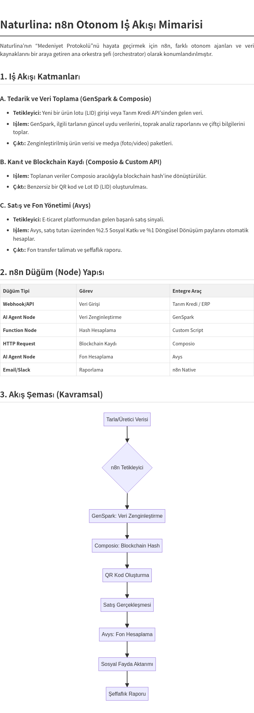

# Naturlina: Emanet Mirası ve Medeniyet Protokolü

Naturlina, geleneksel bir marka olmaktan öte, toplumsal ve ahlaki bir sistem kurma iddiasında olan yenilikçi bir projedir. Ticari bir varlık olarak ürün satarken, "emanet mirası" kavramıyla şeffaflık ve değer paylaşımı sağlar.

**Vizyon:** Ürün satışını sadece ticaret değil, nesiller arası taşınabilir bir miras haline getirmek. "İyiliği sisteme gömmek" felsefesiyle, her işlem sosyal fayda üretir.

**Ana Unsurlar:** Maddi ve Ahlaki Emanet Mirası, Medeniyet Protokolü.

Bu proje, Naturlina’nın 2026 vizyonunu temel alır – sürdürülebilirlik ve etik ticaret trendlerine uyumlu bir yaklaşım sunar.

## Proje Belgeleri

*   [Vizyon (VISION.md)](VISION.md): Projenin temel felsefesi ve katmanları.
*   [Medeniyet Protokolü (PROTOCOL.md)](PROTOCOL.md): Protokolün teknik ve ahlaki detayları.
*   [n8n İş Akışı (WORKFLOW.md)](WORKFLOW.md): Otonom ajanların orkestrasyonu ve iş akışı mimarisi.
*   [Entegrasyon Stratejisi (INTEGRATION_STRATEGY.md)](INTEGRATION_STRATEGY.md): GenSpark, Avys ve Composio gibi araçların entegrasyon planı.

## İş Akışı Şeması

