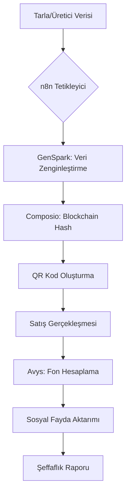

# Naturlina: n8n Otonom İş Akışı Mimarisi

Naturlina'nın "Medeniyet Protokolü"nü hayata geçirmek için n8n, farklı otonom ajanları ve veri kaynaklarını bir araya getiren ana orkestra şefi (orchestrator) olarak konumlandırılmıştır.

## 1. İş Akışı Katmanları

### A. Tedarik ve Veri Toplama (GenSpark & Composio)
*   **Tetikleyici:** Yeni bir ürün lotu (LID) girişi veya Tarım Kredi API'sinden gelen veri.
*   **İşlem:** GenSpark, ilgili tarlanın güncel uydu verilerini, toprak analiz raporlarını ve çiftçi bilgilerini toplar.
*   **Çıktı:** Zenginleştirilmiş ürün verisi ve medya (foto/video) paketleri.

### B. Kanıt ve Blockchain Kaydı (Composio & Custom API)
*   **İşlem:** Toplanan veriler Composio aracılığıyla blockchain hash'ine dönüştürülür.
*   **Çıktı:** Benzersiz bir QR kod ve Lot ID (LID) oluşturulması.

### C. Satış ve Fon Yönetimi (Avys)
*   **Tetikleyici:** E-ticaret platformundan gelen başarılı satış sinyali.
*   **İşlem:** Avys, satış tutarı üzerinden %2.5 Sosyal Katkı ve %1 Döngüsel Dönüşüm paylarını otomatik hesaplar.
*   **Çıktı:** Fon transfer talimatı ve şeffaflık raporu.

## 2. n8n Düğüm (Node) Yapısı

| Düğüm Tipi | Görev | Entegre Araç |
| :--- | :--- | :--- |
| **Webhook/API** | Veri Girişi | Tarım Kredi / ERP |
| **AI Agent Node** | Veri Zenginleştirme | GenSpark |
| **Function Node** | Hash Hesaplama | Custom Script |
| **HTTP Request** | Blockchain Kaydı | Composio |
| **AI Agent Node** | Fon Hesaplama | Avys |
| **Email/Slack** | Raporlama | n8n Native |

## 3. Akış Şeması (Kavramsal)

